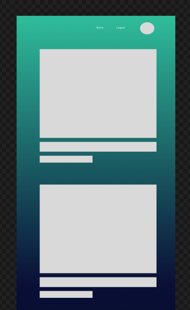
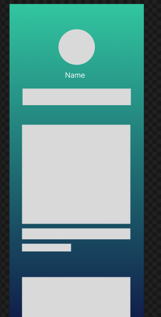

<h1>Plan for the social media app</h1>

Codify: A platform for sharing interesting images, quotes or videos found from across the internet 

<strong>Description:</strong> I want to build a social media app, where multiple users can interact and share posts with each other. When the page first loads, it asks for authentification just so you can access and see all the posts from users. Users can like and comment on each other's post and they will all have the ability to publish their own post.

<h2>Design</h2>
<h3>Pages</h3>
<ul>
    <li><strong>Home:</strong> Either show login page or display all posts after user login</li>
    <li><strong>Profile:</strong> Only shows after user login and display all post from a single user</li>
    <li><strong>Indivual post page:</strong> users can view individual posts</li>
    <li><strong>Edit post page:</strong>users will be redirect here to edit their posts</li>
    <li><strong>Create post page:</strong>users will be redirect here to create their posts</li>
</ul>

<h3>Wireframes:</h3>
<h4>Login page</h4>

<h4>Homepage page</h4>

<h4>Profile page</h4>

<h4>Create Post page</h4>

Technologies used: HTML CSS JavaScript node.js MongoDB Mongoose

getting started : https://codify.fly.dev/

Next Steps:

I would like to add some Dom functionalities

I would like to add a news apis 
I want more social feature like sharing, saving and fowarding
Add a direct messaging feature (sockets)
Add more css styles
Implement Emojis

