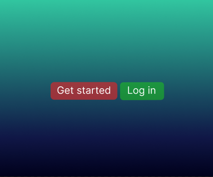
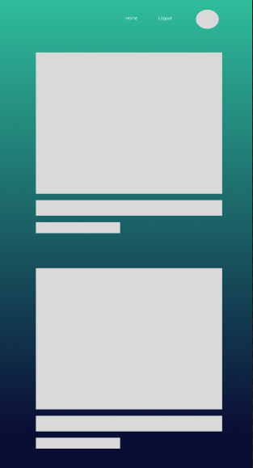

<h1>Plan for the social media app</h1>

Codify: A platform for sharing interesting images, quotes or videos found from across the internet  
Description: I want to build a social media app, where multiple users can interact with each other, share posts and privately message one another. When the page first loads, it asks for authentification just so you can access and see all the posts from users. Users can like and comment on each other's post and they will all have the ability to publish their own post.

<h2>Design</h2>
<h3>Pages</h3>
<ul>
    <li><strong>Home:</strong> Either show login page or display all posts after user login</li>
    <li><strong>Profile:</strong> Only shows after user login and display all post from a single user</li>
    <li><strong>Message page:</strong>Holds all the messages you sent</li>
    <li><strong>Indivual post page:</strong> users can view individual posts</li>
    <li><strong>Edit post page:</strong>users will be redirect here to edit their posts</li>
    <li><strong>Create post page:</strong>users will be redirect here to create their posts</li>
</ul>

<h4>ERD diagram</h4>
<a href="https://lucid.app/lucidchart/b908b16e-e530-420f-8b43-b1dff566e7f3/edit?viewport_loc=-478%2C-21%2C3119%2C1558%2C6XbYu1LsVqS5&invitationId=inv_0f2410a2-f7dd-41b8-838f-9c2632d445eb"> Link to ERD</a>

<h3>Wireframes:</h3>
<h4>Login page</h4>

<h4>Homepage page</h4>

<h4>Profile page</h4>

<h4>Create Post page</h4>

<h4>Direct Message page</h4>

<h3>Trello board:</h3>
<a href="https://trello.com/invite/b/UuHp0Lqr/ATTI5aff67f1eea6b810134fd20a0e325b31E1BA7F6C/simple-project-board"> Link to Trello</a>

